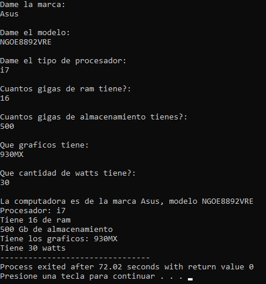

# Computer Specification Manager

A console-based application for storing and displaying computer hardware specifications using C structures.

## Overview

This project demonstrates how structures can be used to model a real-world object by representing the specifications of a computer.

The user enters information about a computer, including its brand, model, processor, memory, storage, graphics, and power supply. The program then displays the collected information in a formatted summary.

## Features

- Store computer hardware information.
- User input through the console.
- Display a formatted specification summary.
- Dynamic memory allocation for text fields.
- Structure-based data organization.

## Screenshot



## Technologies

- C
- Standard C Library
- Dev-C++

## Project Structure

```text
.
├── assets
│   └── images
│       └── computer_specification_manager_demo.jpg
├── computer_specification_manager.cpp
├── README.md
├── LICENSE
└── .gitignore
```

## How to Compile

Using GCC:

```bash
g++ computer_specification_manager.cpp -o computer_specification_manager
```

## How to Run

Windows

```bash
computer_specification_manager.exe
```

Linux/macOS

```bash
./computer_specification_manager
```

## Concepts Demonstrated

- Structures (`struct`)
- Dynamic memory allocation
- Character arrays and strings
- User input
- Function parameter passing
- Data modeling

## Future Improvements

- Allocate memory dynamically based on string length.
- Replace deprecated input functions with safer alternatives.
- Store multiple computer records.
- Save specifications to a file.
- Add editing and search functionality.

## License

This project is licensed under the MIT License.

## Author

Luis Alva
